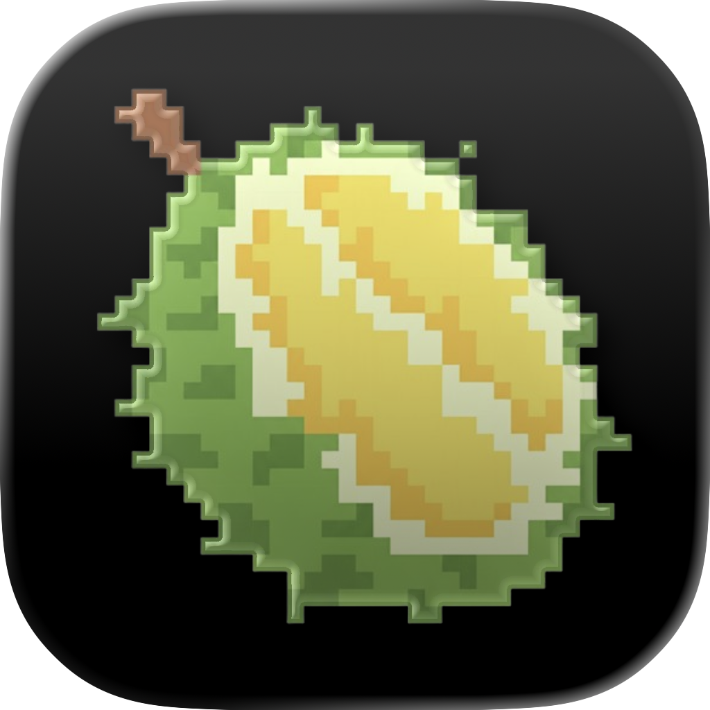
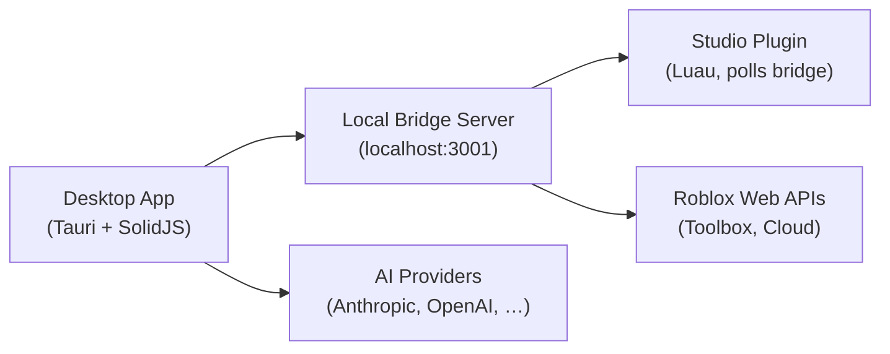

<p align="center">
  
</p>

<h1 align="center">Stud</h1>

<p align="center">
  <strong>AI-powered development tool for Roblox Studio</strong>
</p>

<p align="center">
  <a href="https://github.com/stud-ai/stud/blob/main/LICENSE"></a>
  <a href="https://github.com/stud-ai/stud/stargazers"></a>
  <a href="https://github.com/stud-ai/stud"></a>
  <a href="https://github.com/stud-ai/stud"></a>
</p>

<p align="center">
  <a href="#quick-start">Quick Start</a> •
  <a href="#features">Features</a> •
  <a href="#architecture">Architecture</a> •
  <a href="#sdk">SDK</a> •
  <a href="#contributing">Contributing</a>
</p>

---

Stud connects an AI agent directly to Roblox Studio through a local plugin.  
It can inspect and modify scripts, instances, and properties in real time — so you can **build games with natural language**.

## Features

🤖 **AI Agent** — Chat-driven development with tool use, code generation, and multi-step planning  
🔌 **Live Studio Integration** — Real-time bridge to Roblox Studio via a lightweight Luau plugin  
🛠️ **Script Editing** — Read, write, and patch scripts directly inside Studio  
🧩 **Toolbox & Cloud APIs** — Search assets, manage DataStores, and publish from the desktop  
📂 **Rojo Support** — File-based workflows with full Rojo project integration  
🌐 **Multi-Provider** — Supports Anthropic, OpenAI, Google, Groq, Mistral, and more  
🖥️ **Native Desktop App** — Built with Tauri + SolidJS for a fast, native experience  

## Quick Start

```bash
./start.sh
```

The start script handles everything:

1. ✅ Checks prerequisites (Bun, Rust, platform deps)
2. 📦 Installs workspace dependencies
3. 🔌 Installs or updates the Studio plugin
4. 🚀 Starts the desktop app

> **Options:** `--check` (validate only) · `--build` (production build) · `--skip-plugin` · `--help`

### Studio Setup

1. Open **Roblox Studio**
2. Go to **Game Settings → Security** and enable **Allow HTTP Requests**
3. Open the **Plugins** tab and click **Stud**
4. Keep the desktop app running while you work

## Requirements

| Dependency | Version | Required |
|------------|---------|----------|
| [Bun](https://bun.sh/) | `≥ 1.0` | ✅ |
| [Rust](https://www.rust-lang.org/tools/install) | Latest stable | ✅ |
| Roblox Studio | — | ✅ |
| [Rojo](https://rojo.space/) | Latest | Optional |

## Common Commands

```bash
# Start development (Tauri + Vite)
bun run dev

# Build for production
bun run build

# Typecheck entire workspace
bun run typecheck
```

## Architecture



### Repository Layout

```
stud/
├── packages/
│   ├── app/            # Desktop app UI (SolidJS)
│   ├── core/           # AI engine — tools, sessions, providers, server
│   ├── desktop/        # Tauri native shell
│   ├── sdk/            # TypeScript SDK (@stud/sdk)
│   ├── ui/             # Shared UI component library
│   ├── util/           # Shared utilities
│   ├── plugin/         # Plugin SDK for extensions
│   ├── identity/       # Brand assets (logos, icons)
│   └── script/         # Build scripts
├── studio-plugin/      # Roblox Studio plugin (Luau)
├── stud-website/       # Marketing website (Next.js)
├── launch-video/       # Launch video (Remotion)
├── docs/               # Technical documentation
└── start.sh            # Setup & launch script
```

## SDK

The monorepo includes a TypeScript SDK at `packages/sdk/js` (`@stud/sdk`):

```ts
import { createStud } from "@stud/sdk"

const stud = await createStud()
const session = await stud.client.session.create({
  directory: "/path/to/project",
})

await stud.client.session.prompt(session.id, {
  content: "Create a part in Workspace",
})
```

## Plugin Installation

The `start.sh` script installs the plugin automatically. To install manually:

| OS | Plugin Path |
|----|-------------|
| macOS | `~/Documents/Roblox/Plugins/Stud.server.lua` |
| Windows | `%LOCALAPPDATA%\Roblox\Plugins\Stud.server.lua` |
| Linux | `~/.local/share/roblox/plugins/Stud.server.lua` |

Copy `studio-plugin/Stud.server.lua` to the path above, then restart Studio.

## Cloud API Configuration

For DataStore and publishing operations, set these environment variables:

```bash
export ROBLOX_API_KEY="your-api-key"
export ROBLOX_UNIVERSE_ID="your-universe-id"
```

Create API keys at [Roblox Creator Hub → Credentials](https://create.roblox.com/dashboard/credentials).

## Built With

| Technology | Purpose |
|-----------|---------|
| [Tauri v2](https://tauri.app/) | Native desktop shell |
| [SolidJS](https://solidjs.com/) | Reactive UI framework |
| [Bun](https://bun.sh/) | Runtime & package manager |
| [Vercel AI SDK](https://sdk.vercel.ai/) | Multi-provider AI integration |
| [Hono](https://hono.dev/) | Local bridge server |
| [Remotion](https://remotion.dev/) | Launch video |

## Troubleshooting

| Problem | Solution |
|---------|----------|
| "Could not connect to server" | Ensure the desktop app is running, the plugin is installed, and Studio HTTP requests are enabled |
| Plugin not appearing | Verify the plugin path and restart Roblox Studio |
| Setup issues | Run `./start.sh --check` to validate prerequisites |
| White screen on restart | The app auto-recovers; if not, it falls back to a page reload |

## Contributing

Before opening a PR:

```bash
bun run typecheck
```

See [AGENTS.md](AGENTS.md) for coding style guidelines.

## License

[GPL-3.0](LICENSE)
