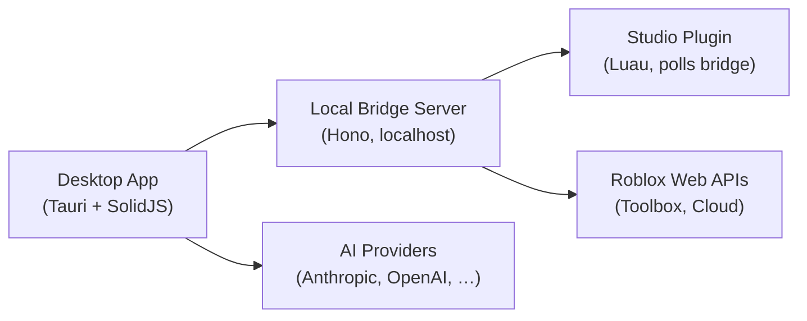

# Stud Documentation

> Technical documentation for contributors and developers working on the Stud monorepo.

## Repository Overview

Stud is an AI-powered development tool for Roblox Studio. It connects a desktop AI agent to Roblox Studio in real time through a local plugin, enabling developers to build games with natural language.

The project is structured as a **Bun monorepo** with the following top-level layout:

```
stud/
├── packages/           # Core workspace packages
│   ├── app/            # Desktop app UI (SolidJS)
│   ├── core/           # AI engine — CLI, tools, providers, server
│   ├── desktop/        # Tauri native shell
│   ├── identity/       # Brand assets (logos, icons)
│   ├── plugin/         # Plugin SDK for extensions
│   ├── script/         # Build & release scripts
│   ├── sdk/            # TypeScript SDK (@stud/sdk)
│   ├── ui/             # Shared UI component library
│   └── util/           # Shared utility functions
├── studio-plugin/      # Roblox Studio plugin (Luau)
├── stud-website/       # Marketing website (Next.js)
├── launch-video/       # Launch video (Remotion)
├── docs/               # Technical documentation (you are here)
├── start.sh            # Setup & launch script
├── AGENTS.md           # Coding style guidelines
└── LICENSE             # GPL-3.0
```

## Package Documentation

| Package | Description | Docs |
|---------|-------------|------|
| `packages/core` | AI engine, CLI, tools, session management, providers | [core.md](./core.md) |
| `packages/app` | Desktop application UI built with SolidJS | [app.md](./app.md) |
| `packages/desktop` | Tauri v2 native shell for macOS, Windows, Linux | [desktop.md](./desktop.md) |
| `packages/ui` | Shared UI component library and design system | [ui.md](./ui.md) |
| `packages/sdk` | TypeScript SDK for programmatic access | [sdk.md](./sdk.md) |
| `packages/plugin` | Plugin SDK for extending Stud with custom hooks | [plugin.md](./plugin.md) |
| `packages/util` | Shared utility functions | [util.md](./util.md) |
| `packages/identity` | Brand assets — logos, icons, marks | [identity.md](./identity.md) |
| `packages/script` | Build scripts, version resolution, release channels | [script.md](./script.md) |

## Other Directories

| Directory | Description | Docs |
|-----------|-------------|------|
| `studio-plugin/` | Roblox Studio Luau plugin | [studio-plugin.md](./studio-plugin.md) |
| `stud-website/` | Marketing website (Next.js) | [website.md](./website.md) |
| `launch-video/` | Launch video built with Remotion | [launch-video.md](./launch-video.md) |

## Key Files

| File | Description |
|------|-------------|
| `start.sh` | One-command setup and launch — installs deps, plugin, starts dev server |
| `AGENTS.md` | Coding style guidelines (no `let`, no `else`, single-word names, etc.) |
| `turbo.json` | Turborepo pipeline configuration (typecheck) |
| `tsconfig.json` | Root TypeScript configuration |
| `package.json` | Workspace root — defines workspaces, catalog, and scripts |

## Architecture



### Data Flow

1. User sends a natural-language prompt in the desktop app
2. The **core** engine selects an AI provider, builds a system prompt, and sends the request
3. The AI responds with tool calls (read file, edit script, create instance, etc.)
4. Tool calls that target Roblox Studio are sent through the **bridge server** to the **Studio plugin**
5. The plugin executes the operation inside Studio and returns the result
6. Results are fed back to the AI for the next step

## Getting Started

```bash
# Clone and run — the start script handles everything
./start.sh

# Or start manually
bun install
bun run dev
```

See the [root README](../README.md) for full setup instructions.
